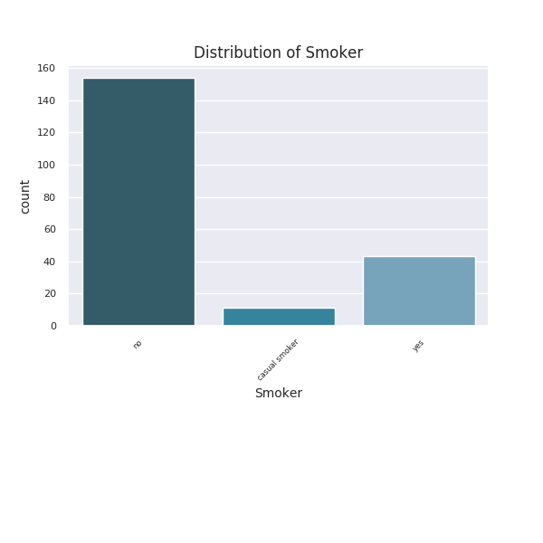
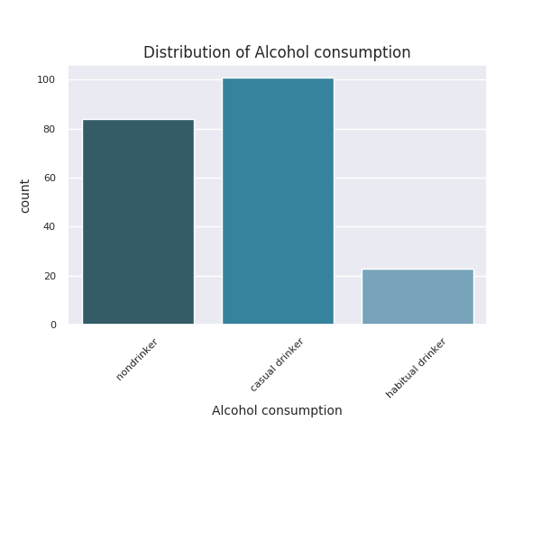
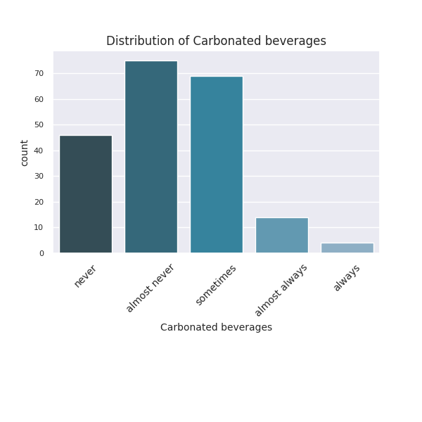
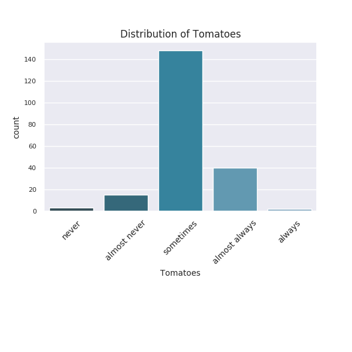

#### Descriptive stats for Age

|       |      Age |
|:------|---------:|
| count | 208      |
| mean  |  44.0865 |
| std   |  13.7438 |
| min   |  18      |
| 25%   |  32.75   |
| 50%   |  45      |
| 75%   |  55      |
| max   |  70      |

#### Descriptive stats for Gender

|        | Gender   |
|:-------|:---------|
| count  | 208      |
| unique | 2        |
| top    | f        |
| freq   | 136      |

#### Descriptive stats for Diagnosis

|        | Diagnosis   |
|:-------|:------------|
| count  | 208         |
| unique | 27          |
| top    | healthy     |
| freq   | 57          |

#### Descriptive stats for Occupation status

|        | Occupation status   |
|:-------|:--------------------|
| count  | 208                 |
| unique | 26                  |
| top    | Researcher          |
| freq   | 43                  |

#### Descriptive stats for Voice Handicap Index (VHI) Score

|       |   Voice Handicap Index (VHI) Score |
|:------|-----------------------------------:|
| count |                           208      |
| mean  |                            23.8462 |
| std   |                            23.5884 |
| min   |                             0      |
| 25%   |                             5      |
| 50%   |                            17      |
| 75%   |                            35      |
| max   |                           106      |

_Score.png)

#### Descriptive stats for Reflux Symptom Index (RSI) Score

|       |   Reflux Symptom Index (RSI) Score |
|:------|-----------------------------------:|
| count |                          208       |
| mean  |                           11.9904  |
| std   |                            8.30284 |
| min   |                            0       |
| 25%   |                            5       |
| 50%   |                           12       |
| 75%   |                           18       |
| max   |                           41       |

_Score.png)

#### Descriptive stats for Smoker

|        | Smoker   |
|:-------|:---------|
| count  | 208      |
| unique | 3        |
| top    | no       |
| freq   | 154      |

#### Descriptive stats for Number of cigarettes smoked per day

|       |   Number of cigarettes smoked per day |
|:------|--------------------------------------:|
| count |                             208       |
| mean  |                               3.01442 |
| std   |                               7.18189 |
| min   |                               0       |
| 25%   |                               0       |
| 50%   |                               0       |
| 75%   |                               0       |
| max   |                              40       |

#### Descriptive stats for Alcohol consumption

|        | Alcohol consumption   |
|:-------|:----------------------|
| count  | 208                   |
| unique | 3                     |
| top    | casual drinker        |
| freq   | 101                   |

#### Descriptive stats for Amount of water's litres drink every day

|       |   Amount of water's litres drink every day |
|:------|-------------------------------------------:|
| count |                                 208        |
| mean  |                                   1.43149  |
| std   |                                   0.471206 |
| min   |                                   0.25     |
| 25%   |                                   1        |
| 50%   |                                   1.5      |
| 75%   |                                   2        |
| max   |                                   2.5      |

#### Descriptive stats for Carbonated beverages

|        | Carbonated beverages   |
|:-------|:-----------------------|
| count  | 208                    |
| unique | 5                      |
| top    | almost never           |
| freq   | 75                     |

#### Descriptive stats for Tomatoes

|        | Tomatoes   |
|:-------|:-----------|
| count  | 208        |
| unique | 5          |
| top    | sometimes  |
| freq   | 148        |

#### Descriptive stats for Coffee

|        | Coffee   |
|:-------|:---------|
| count  | 208      |
| unique | 5        |
| top    | always   |
| freq   | 143      |

#### Descriptive stats for Chocolate

|        | Chocolate   |
|:-------|:------------|
| count  | 208         |
| unique | 5           |
| top    | sometimes   |
| freq   | 125         |

#### Descriptive stats for Soft cheese

|        | Soft cheese   |
|:-------|:--------------|
| count  | 208           |
| unique | 5             |
| top    | sometimes     |
| freq   | 141           |

#### Descriptive stats for Citrus fruits

|        | Citrus fruits   |
|:-------|:----------------|
| count  | 208             |
| unique | 5               |
| top    | sometimes       |
| freq   | 108             |

#### Correlation of the predicted variables

