# Final Report

## 1. Problem Statement

The data consists of audio features and individual life style and demographic features.
The goal is to determine if the individual features can be predicted from the audio features.

## 2. Exploratory Data Analysis

### Dataset

The independent features consist of 1582 acoustic features for 208 individuals encoded in
the INTERSPEECH 2010 Paralinguistic Challenge feature set. The dependent
features consist of 16 categorical or numerical features.

### Independent Variables

A look at the description of the independent features leads to the hypothesis that the
features are highly redundant. Performing a Principal Component Analysis confirms this
hypothesis.

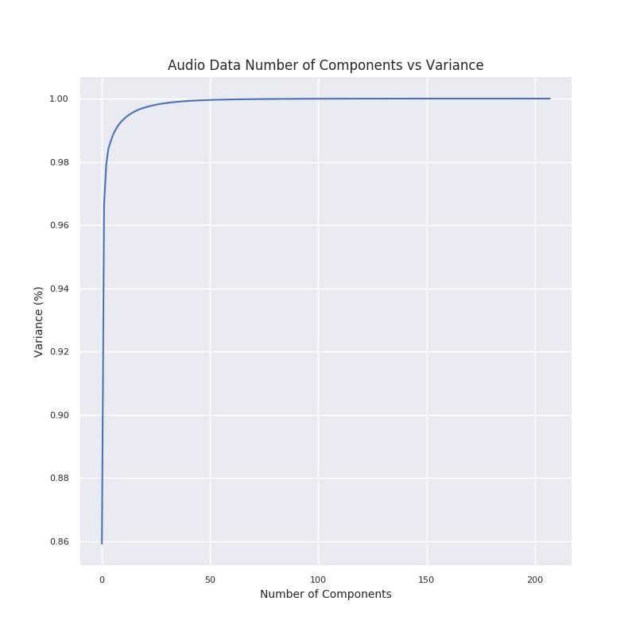

Compressing the independent features to 25 principal compponents retains 
about 99.5 % of the data's variance. In the following, the number of components
has been set to 30.

### Predicted Variables

#### 1 Descriptive stats for Age

|       |      Age |
|:------|---------:|
| count | 208      |
| mean  |  44.0865 |
| std   |  13.7438 |
| min   |  18      |
| 25%   |  32.75   |
| 50%   |  45      |
| 75%   |  55      |
| max   |  70      |

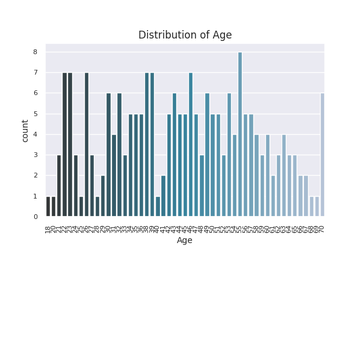

#### 2 Descriptive stats for Gender

|        | Gender   |
|:-------|:---------|
| count  | 208      |
| unique | 2        |
| top    | f        |
| freq   | 136      |

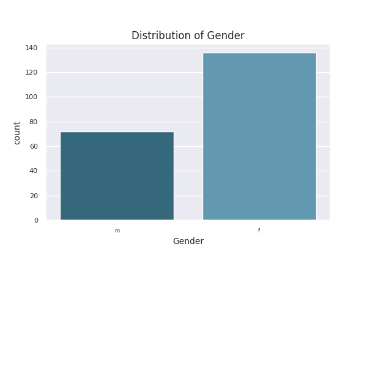

#### 3 Descriptive stats for Diagnosis

|        | Diagnosis   |
|:-------|:------------|
| count  | 208         |
| unique | 27          |
| top    | healthy     |
| freq   | 57          |

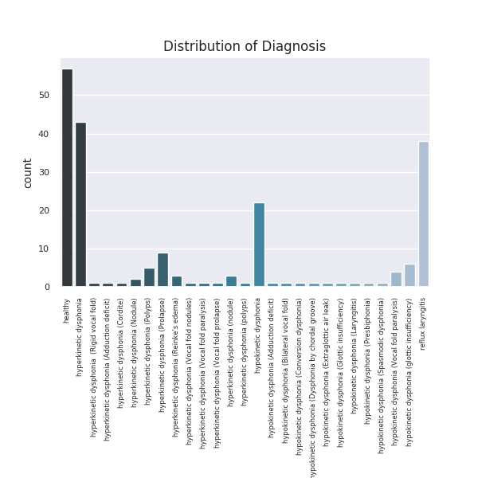

#### 4 Descriptive stats for Occupation status

|        | Occupation status   |
|:-------|:--------------------|
| count  | 208                 |
| unique | 26                  |
| top    | Researcher          |
| freq   | 43                  |

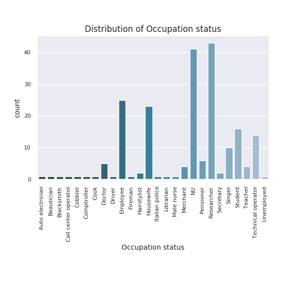

#### 5 Descriptive stats for Voice Handicap Index (VHI) Score

|       |   Voice Handicap Index (VHI) Score |
|:------|-----------------------------------:|
| count |                           208      |
| mean  |                            23.8462 |
| std   |                            23.5884 |
| min   |                             0      |
| 25%   |                             5      |
| 50%   |                            17      |
| 75%   |                            35      |
| max   |                           106      |

_Score.png)

#### 6 Descriptive stats for Reflux Symptom Index (RSI) Score

|       |   Reflux Symptom Index (RSI) Score |
|:------|-----------------------------------:|
| count |                          208       |
| mean  |                           11.9904  |
| std   |                            8.30284 |
| min   |                            0       |
| 25%   |                            5       |
| 50%   |                           12       |
| 75%   |                           18       |
| max   |                           41       |

_Score.png)

#### 7 Descriptive stats for Smoker

|        | Smoker   |
|:-------|:---------|
| count  | 208      |
| unique | 3        |
| top    | no       |
| freq   | 154      |

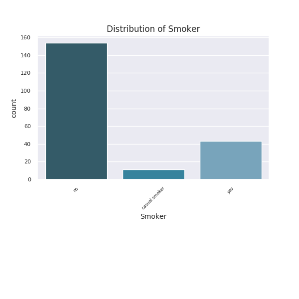

#### 8 Descriptive stats for Number of cigarettes smoked per day

|       |   Number of cigarettes smoked per day |
|:------|--------------------------------------:|
| count |                             208       |
| mean  |                               3.01442 |
| std   |                               7.18189 |
| min   |                               0       |
| 25%   |                               0       |
| 50%   |                               0       |
| 75%   |                               0       |
| max   |                              40       |

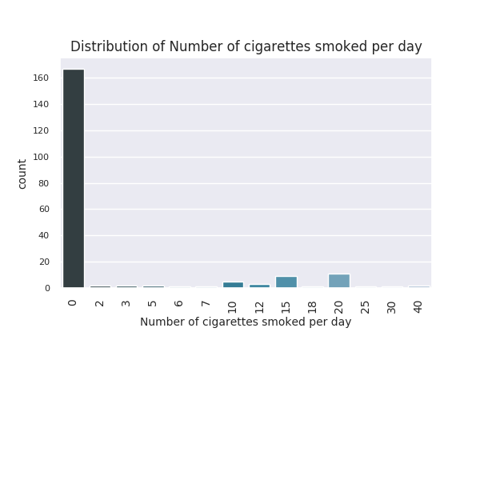

#### 9 Descriptive stats for Alcohol consumption

|        | Alcohol consumption   |
|:-------|:----------------------|
| count  | 208                   |
| unique | 3                     |
| top    | casual drinker        |
| freq   | 101                   |

#### 10 Descriptive stats for Amount of water's litres drink every day

|       |   Amount of water's litres drink every day |
|:------|-------------------------------------------:|
| count |                                 208        |
| mean  |                                   1.43149  |
| std   |                                   0.471206 |
| min   |                                   0.25     |
| 25%   |                                   1        |
| 50%   |                                   1.5      |
| 75%   |                                   2        |
| max   |                                   2.5      |

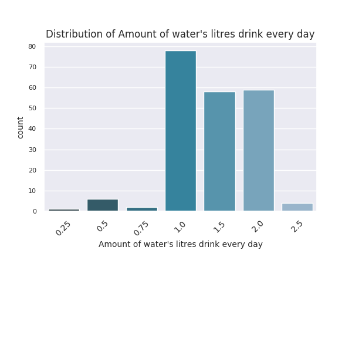

#### 11 Descriptive stats for Carbonated beverages

|        | Carbonated beverages   |
|:-------|:-----------------------|
| count  | 208                    |
| unique | 5                      |
| top    | almost never           |
| freq   | 75                     |

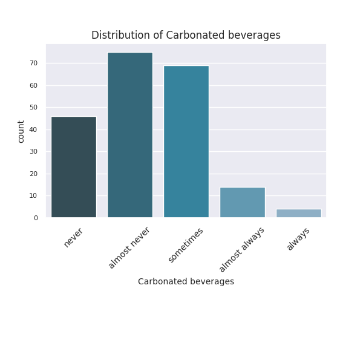

#### 12 Descriptive stats for Tomatoes

|        | Tomatoes   |
|:-------|:-----------|
| count  | 208        |
| unique | 5          |
| top    | sometimes  |
| freq   | 148        |

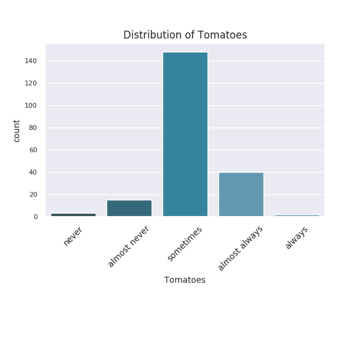

#### 13 Descriptive stats for Coffee

|        | Coffee   |
|:-------|:---------|
| count  | 208      |
| unique | 5        |
| top    | always   |
| freq   | 143      |

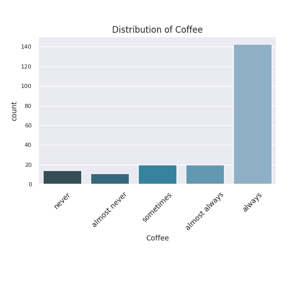

#### 14 Descriptive stats for Chocolate

|        | Chocolate   |
|:-------|:------------|
| count  | 208         |
| unique | 5           |
| top    | sometimes   |
| freq   | 125         |

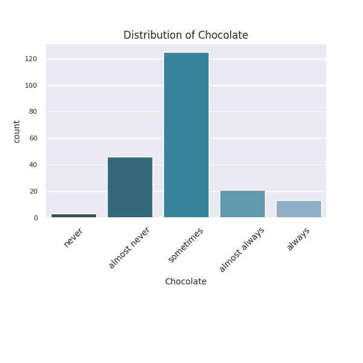

#### 15 Descriptive stats for Soft cheese

|        | Soft cheese   |
|:-------|:--------------|
| count  | 208           |
| unique | 5             |
| top    | sometimes     |
| freq   | 141           |

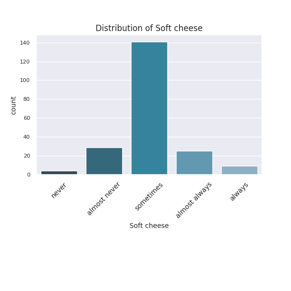

#### 16 Descriptive stats for Citrus fruits

|        | Citrus fruits   |
|:-------|:----------------|
| count  | 208             |
| unique | 5               |
| top    | sometimes       |
| freq   | 108             |

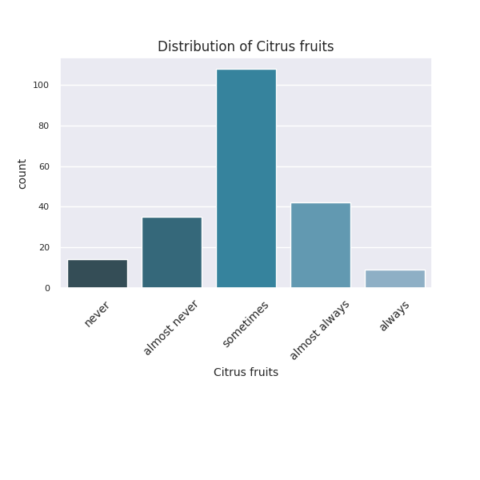

### Dependent Variable Observations

The following table shows how the dependent variables 
are to be predicted:

| Variable Name                             | Type           | Encoding     | Modeled |
|:------------------------------------------|:---------------|:-------------|:--------|
| Age                                       | Regression     | integer      | No      |
| Gender                                    | Classification | 2            | Yes     | 
| Diagnosis                                 | Classification | 27           | Yes     |
| Occupation status                         | Classification | 26           | Yes     |            
| Voice Handicap Index (VHI) Score          | Regression     | integer      | No      |
| Reflux Symptom Index (RSI) Score          | Regression     | integer      | No      |
| Smoker                                    | Classification | 3            | Yes     |
| Number of cigarettes smoked per day       | Regression     | integer      | No      | 
| Amount of water's litres drink every day  | Regression     | float        | No      |
| Alcohol consumption                       | Classification | 3            | Yes |
| Carbonated beverages                      | Classification | 5            | Yes |
| Tomatoes                                  | Classification | 5            | Yes | 
| Coffee                                    | Classification | 5            | Yes | 
| Chocolate                                 | Classification | 5            | Yes | 
| Soft cheese                               | Classification | 5            | Yes | 
| Citrus fruits                             | Classification | 5            | Yes |

In this exercise, the focus was on classification tasks. No regression
was implemented. In addition, Diagnosis and Occupation Status 
was not modeled due to data sparseness.

The strong imabalance in the dataset requires extra precaution during 
training to be taken. 

The dependent features are lightly correlated. Excluding the variables `Smoker`
and `Number of cigarettes smoked per day` (which are expected to be highly correlated,
the maximum positive correlation between dependent features is
0.291, and the maximum negative correlation is -0.217.

#### Dependent Variable Correlation

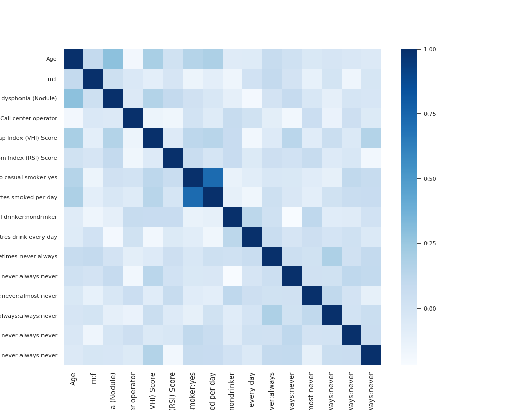

## 3. Data Cleaning

Several records in the dataset contain illegal or otherwise
invalid values. The following data cleaning operations were implemented.

1. The column `ID` was deleted from the dataset as it has no bearing on the 
classification. 

2. Non-smokers were indicated by both `No` and `no`. This was normalized to `no`.

3. The variable `Amount of water's litres drink every day` was stored as string
using commas instead of decimal points. The strings were normalized and converted
to floating point numbers. 

4. The `Number of cigarettes smoked per day` was represented as strings and 
contained the string `Nu` to represent no cigarettes. `Nu` was replaced 
with 0 and the column was converted to integers.

No rows were deleted as the above transformations resulted in 
valid data.

## 4. Feature Engineering

One dependent variable has been added. Since the number of
diagnoses is high compared to the size of the training set,
and the some diagnoses appear only once, the diagnoses
have been simplified by removing the text in brackets.

#### Descriptive stats for Diagnosis_Simple

|        | Diagnosis_Simple       |
|:-------|:-----------------------|
| count  | 208                    |
| unique | 5                      |
| top    | hyperkinetic dysphonia |
| freq   | 72                     |

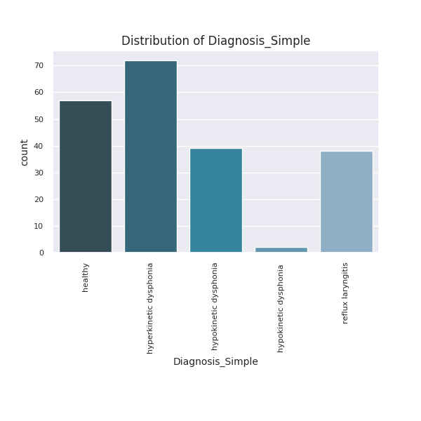

## 5. Models and Training

### Models

The following models were implemented:
1. Multilayer Perceptron
2. Random Forest
3. Logistic Regression
4. Linear SVC
5. Radial SVC

### Training

All models were trained on data compressed to 30 principal 
components. Training was done using 10 fold cross validation.
In order to address the imbalanced datasets, the following
resampling methods have been implemented:

1. For MLP: None and balanced batch
2. For all others: None and random oversampling

## 6. Results

[Detailed results](Results.md) of all training runs show
accuracy, precision, recall, f1 score and roc-auc score for
different classifiers trained on `Alcohol consumption,Carbonated beverages,Chocolate,Coffee,Diagnosis,
Gender,Occupation status,Smoker,Soft cheese` and `Tomatoes`.

The variables that can best be modeled is `Gender`. The variables
that cannot be modeled are `Diagnosis` and `Occupation status`.

## 7. Future Work

1. Train MLP on multiple targets
2. Optimize hyperparameters using gridsearch
